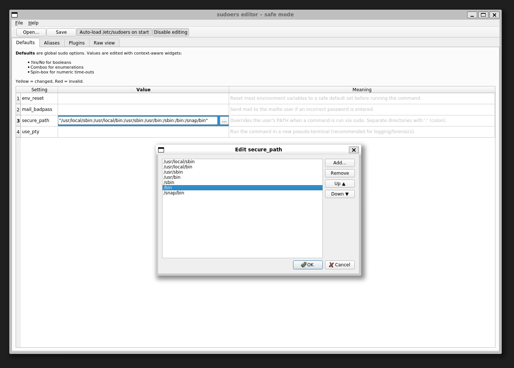

# sudo-GUI – a friendly Qt-6 editor for `/etc/sudoers`
_(a safe-mode replacement for `visudo`)_

---



## Features

* **Visual Defaults editor**  
  ─ context-aware widgets (Yes/No combos, enums, spin-boxes, path picker)

* **Alias editor**  
  ─ User/Runas/Host/Cmnd aliases with instant validation

* **Plugins & Raw view**  
  ─ read-only lists of compiled sudo plugins and the untouched file

* **100 % safe writes**  
  * Timestamped backup of the original file  
  * All saves go through `visudo -c` → impossible to write an invalid sudoers

---

## Quick start (no packaging, no install)

```bash
# 1.  Stand in the directory *above* the code folder
$ cd /path/to/parent/of/sudo_gui/

# 2.  Make sure PyQt ≥ 6.5 is available
$ python -m pip install "PyQt6>=6.5"

# 3.  Launch the GUI **as root** so it can read /etc/sudoers
$ sudo "$(command -v python)" -m sudo_gui
```

## Optional: created an isolated Conda env

```bash
$ conda create -n sudo-gui python=3.11 pyqt>=6.5

$ conda activate sudo-gui

$ sudo "$(command -v python)" -m sudo_gui   # same launch command
